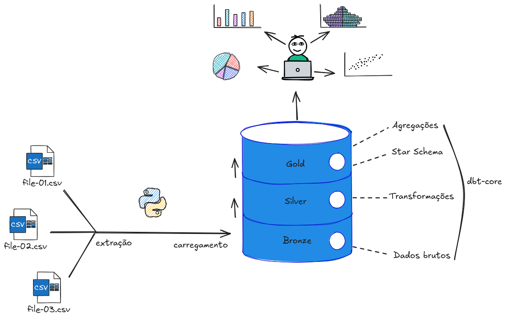

# Qualidade do Ar em Alguns Estados Brasileiros


## 🎯 Sobre o Projeto

Este projeto nasceu da necessidade de demonstrar, com dados concretos, a correlação entre a poluição do ar em centros urbanos e a incidência de doenças respiratórias na população. Como consultora ambiental, o objetivo é transformar dados brutos em visualizações claras e impactantes, que possam ser utilizadas em campanhas de conscientização e na formulação de políticas públicas.

A análise cruza informações históricas sobre a **qualidade do ar**, obtidas através de fontes como o sistema **MonitorAr**, com dados de internações e procedimentos relacionados a doenças respiratórias, disponibilizados pelo **DATASUS**.

## ✨ Objetivos Principais

-   **Coletar e Consolidar:** Agregar dados de diferentes fontes em um banco de dados estruturado e confiável.
-   **Analisar:** Identificar tendências, padrões e correlações estatísticas entre os níveis de poluentes e os registros de saúde.
-   **Visualizar:** Criar gráficos e mapas interativos que facilitem a compreensão dos resultados por um público não técnico.
-   **Disponibilizar:** Apresentar os _insights_ em um dashboard interativo, permitindo a exploração dos dados por estado e por período.

## 🔗 Links importantes relacionados aos dados utilizados

-   [MonitorAr](https://dados.gov.br/dados/conjuntos-dados/ar-puro-monitorar)
-   [openDataSUS](https://opendatasus.saude.gov.br/dataset/srag-2021-a-2024)

## 🛠️ Tecnologias Utilizadas

A arquitetura do projeto foi pensada para ser robusta, escalável e reprodutível, utilizando as seguintes tecnologias:

| Tecnologia         | Versão/Descrição | Propósito na Solução                                                              |
| :----------------- | :--------------- | :-------------------------------------------------------------------------------- |
| **PostgreSQL**     | `16-alpine`      | Banco de dados relacional para armazenamento seguro e estruturado.                |
| **Docker**         | `latest`         | Containerização do banco de dados para garantir um ambiente consistente.          |
| **Python**         | `>=3.12`         | Linguagem principal para análise, processamento e visualização.                   |
| **Jupyter**        | `>=1.1.1`        | Análise exploratória de dados (EDA) e prototipagem de modelos.                    |
| **Pandas**         | `>=2.3.1`        | Manipulação, limpeza e estruturação dos dados.                                    |
| **NumPy**          | `>=2.3.1`        | Operações numéricas e cálculos científicos.                                       |
| **Requests**       | `>=2.32.4`       | Realização de requisições HTTP para coleta de dados de APIs externas.             |
| **psycopg**        | `>=3.2.9`        | Conector (código-fonte) para comunicação entre a aplicação Python e o PostgreSQL. |
| **psycopg-binary** | `>=3.2.9`        | Conector para comunicação entre a aplicação Python e o PostgreSQL.                |
| **dbt-postgres**   | `>=1.9.0`        | Ferramenta para transformação de dados (ELT) no data warehouse.                   |
| **Matplotlib**     | `>=3.10.3`       | Criação de gráficos estáticos e customizados.                                     |
| **Seaborn**        | `>=0.13.2`       | Criação de gráficos estatísticos e visualmente atraentes.                         |
| **Scikit-learn**   | `>=1.7.0`        | Modelagem estatística e aplicação de algoritmos de Machine Learning.              |
| **Streamlit**      | `>=1.46.1`       | Construção e deploy do dashboard interativo.                                      |
| **Pytest**         | `>=8.4.1`        | Testes automatizados para garantir a qualidade e a integridade do código.         |
| **python-dotenv**  | `>=1.1.1`        | Gerenciamento de variáveis de ambiente de forma segura.                           |

## 📂 Estrutura do Projeto

**EM PROGRESSO**

```
.
├── docker-compose.yml      # 🐳 Define e gerencia o serviço do banco de dados PostgreSQL.
│
├── notebooks/              # 📓 Ambiente para análise de dados exploratória e experimentação.
│   └── 00_exemplo.ipynb
│
├── postgres_dw/            # 🐘 Diretório raiz do projeto dbt. É aqui que o dbt vai operar.
│   ├── analyses/           # <-- Para análises SQL que não se tornam tabelas ou views (consultas ad-hoc).
│   ├── dbt_project.yml     # <-- Configura o projeto, perfil e caminhos.
│   ├── logs/               # <-- Pasta padrão onde o dbt salva os logs de execução detalhados.
│   │   └── dbt.log
│   ├── macros/             # <-- Para criar funções reutilizáveis em Jinja/SQL.
│   ├── models/             # ✨ Diretório para os modelos SQL de transformação (silver, gold).
│   │   ├── silver/            # 🧼 Camada 2: Limpeza, tipagem e renomeação
│   │   │   └── silver_csv__exemplo.sql
│   │   └── gold/               # 💎 Camada 3: O Star Schema (tabelas Fatos e Dimensões)
│   │       ├── dim_exemplo.sql
│   │       └── fatos_exemplo.sql
│   ├── seeds/              # <-- Para carregar pequenos arquivos CSV no seu DW (ex: uma tabela de mapeamento de estados).
│   ├── snapshots/          # <-- Para capturar mudanças em dados ao longo do tempo (SCD - Slowly Changing Dimensions).
│   ├── target/             # 🎯 Gerado pelo dbt.
│   │   └── ...
│   └── tests/              # <-- Para testes de dados customizados do dbt.
│
├── pyproject.toml          # 🐍 Define as dependências do projeto Python para o 'uv'.
├── README.md               # 📖 A documentação principal do seu projeto.
├── src/                    # 👨‍💻 Código-fonte Python para as etapas de Extração (E) e Carga (L).
│   ├── extract/            # 📥 Módulos para extrair dados das fontes.
│   │   ├── __init__.py         # <-- Transforma 'extract' em um pacote Python.
│   │   └── from_csv.py
│   ├── transform/          # 📥 Módulos para transformações leves nos dados das fontes.
│   │   ├── __init__.py         # <-- Transforma 'transform' em um pacote Python.
│   │   ├── clean_opendatasus.py
│   │   └── clean_monito_ar.py
│   ├── load/               # 📤 Módulo para carregar os dados na camada 'bronze' do DW.
│   │   ├── __init__.py         # <-- Transforma 'load' em um pacote Python.
│   │   └── to_postgres.py
│   ├── __init__.py         # <-- Transforma 'src' em um pacote Python.
│   └── main.py             # 🚀 O orquestrador que chama E, L e a etapa de Transformação (dbt).
│
├── tests/                  # ✅ Pasta para os testes unitários do seu código Python (Pytest).
│   ├── test_extract.py
│   └── test_load.py
└── uv.lock                 # 🔒 Garante que todos usem as mesmas versões das bibliotecas.

```

## Modelagem dos dados



## 🚀 Como Executar o Projeto

Siga os passos abaixo para configurar e rodar o ambiente de desenvolvimento localmente.

### Pré-requisitos

-   [Git](https://git-scm.com/)
-   [Docker](https://www.docker.com/products/docker-desktop/)
-   [Python 3.12+](https://www.python.org/)
-   [uv](https://github.com/astral-sh/uv)

### Instalação

1.  **Clone o repositório:**

    ```bash
    git clone [https://github.com/seu-usuario/seu-repositorio.git](https://github.com/seu-usuario/seu-repositorio.git)
    cd seu-repositorio
    ```

2.  **Configure as variáveis de ambiente:**
    Copie o arquivo de exemplo `.env.example` para um novo arquivo chamado `.env` e preencha com as credenciais do seu banco de dados.

    ```bash
    cp .env.example .env
    ```

3.  **Instale as dependências do projeto:**

    ```bash
    uv sync
    ```

4.  **Ative o ambiente virtual Python:**

    ```bash
    source .venv/bin/activate  # No Windows: .venv\Scripts\activate
    ```

5.  **Inicie o banco de dados com Docker:**
    Este comando irá criar e iniciar o container do PostgreSQL em segundo plano.

    ```bash
    docker compose up -d # ou para versões antigas docker-compose up -d
    ```

6.  **Para utilizar o dbt:**
    Crie um arquivo chamado profiles.yml dentro da pasta `/home/{seu_usuario}/.dbt/`.
    OBS: Pode criar a pasta caso não exista.
    No Windows: `C:\Users\{seu_usuario}\.dbt`.

    ```yml
    postgres_dw:
        outputs:
            dev:
                # MESMAS INFORMAÇÕES DA .env
                dbname: your_database_name
                host: localhost
                pass: database_password
                port: 5432
                schema: public
                threads: 4
                type: postgres
                user: postgres
        target: dev
    ```

    Entre na pasta do projeto dbt.

    ```bash
    cd postgres_dw
    ```

    Instala as dependências do dbt.

    ```bash
    dbt deps
    ```

    Cria as tabelas com base nos CSVs do diretório `postgres_dw/seeds`.

    ```bash
    dbt seed
    ```

    Teste o dbt

    ```bash
    dbt debug --connection
    ```

### Utilização

-   **Extraia os arquivos `*.zip` dentro da pasta `data`:**

-   **Para executar o a pipeline de extração, carregamento e transformação dos dados:**
    Dentro da sessão do ambiente virtual no terminal.

    ```bash
    python3 -m src.main # No Windows: python -m src.main
    ```

-   **Para análise exploratória:**
    Inicie o Jupyter Lab para interagir com os notebooks de análise.

    ```bash
    jupyter lab
    ```

-   **Para visualizar o dashboard:**
    Execute a aplicação Streamlit. O dashboard será aberto automaticamente no seu navegador.

    ```bash
    python3 -m streamlit run streamlit.app # No Windows: python -m streamlit run streamlit.app
    ```

## 📄 Licença

Este projeto está sob a licença MIT. Veja o arquivo `LICENSE` para mais detalhes.
